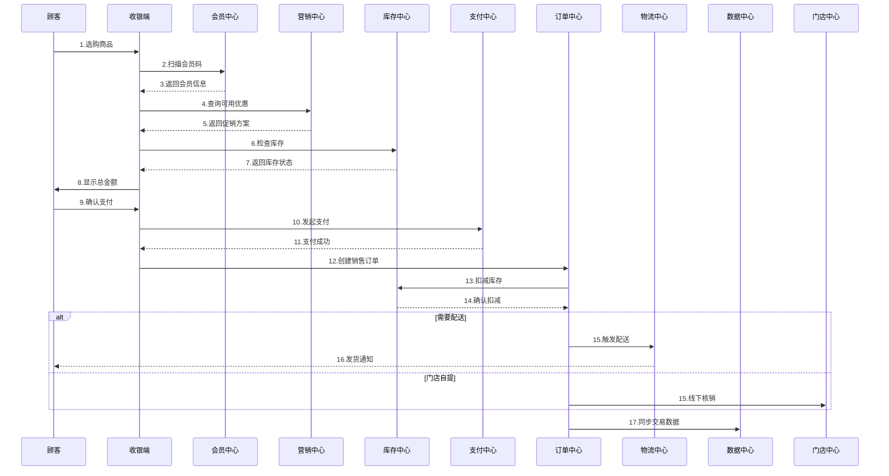
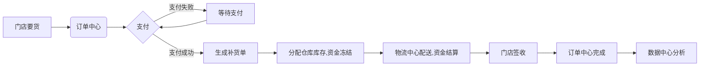
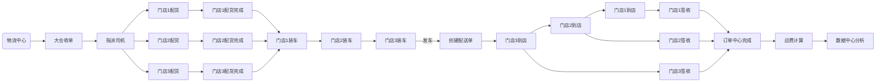
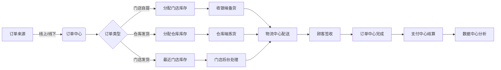

# shop

## introduction
E-commerce platform

## architecture

### core architecture

```mermaid
graph TD
    %% ========== 核心服务模块 ==========
    subgraph 核心服务模块
        GC[商品中心product] 
        GC --- GC1[商品管理]
        GC --- GC2[价格策略]
        GC --- GC3[类目体系]
        GC --- GC4[供应商管理]
        
        MC[会员中心member]
        MC --- MC1[会员档案]
        MC --- MC2[积分体系]
        MC --- MC3[权益管理]
        MC --- MC4[会员分析]
        MC --- MC5[储值管理]
        
        PC[支付中心payment]
        PC --- PC1[pos支付]
        PC --- PC2[门店支付]
        PC --- PC3[大仓支付]
        PC --- PC4[对账系统]
        PC --- PC5[风控系统]
        
        LC[物流中心logistics]
        LC --- LC1[配送管理]
        LC --- LC2[运费计算]
        LC --- LC3[轨迹跟踪]
        LC --- LC4[签收管理]
        
        IC[库存中心inventory]
        IC --- IC1[库存查询]
        IC --- IC2[库存分配]
        IC --- IC3[周转优化]
        IC --- IC4[库存预警]
        
        OC[订单中心order]
        OC --- OC1[订单路由]
        OC --- OC2[pos订单管理]
        OC --- OC3[线上订单管理]
        OC --- OC4[门店订单管理]
        OC --- OC5[状态管理]
        OC --- OC6[履约监控]
        OC --- OC7[售后管理]
        
        MP[营销中心marketing]
        MP --- MP1[促销管理]
        MP --- MP2[优惠券]
        MP --- MP3[精准营销]
        MP --- MP4[活动分析]
        
        DC[数据中心data]
        DC --- DC1[BI分析]
        DC --- DC2[销售预测]
        DC --- DC3[决策支持]
        DC --- DC4[报表系统]
        
        SC[门店中心store]
        SC --- SC1[门店管理]
        SC --- SC2[店员管理]
        SC --- SC3[营业配置]
        SC --- SC4[区域策略]
        SC --- SC5[直供管理]
    end

    %% ========== 门店后台端 ==========
    subgraph 门店后台端
        MB[门店管理]
        MB --- MB1[商品管理] -->|商品管理| GC1
        MB --- MB2[库存视图] -->|实时查询| IC1
        MB --- MB3[订单处理] -->|订单操作| OC3
        MB --- MB4[会员运营] -->|会员管理| MC
        MB --- MB5[营销活动] -->|活动配置| MP
        MB --- MB6[经营分析] -->|数据获取| DC
        MB --- MB7[门店配置] -->|参数设置| SC1
        MB --- MB8[员工管理] -->|权限设置| SC2
        MB --- MB9[采购管理] -->|采购订单| SC5
    end

    %% ========== 仓库端 ==========
    subgraph 仓库端
        WH[仓库管理]
        WH --- WH1[采购入库] -->|入库操作| IC
        WH --- WH2[出库管理] -->|收单发货| LC
        WH --- WH3[库存作业] -->|调拨/盘点| IC
        WH --- WH4[退换管理] -->|退货处理| OC4
        WH --- WH5[库存预警] -->|预警处理| IC4
        WH --- WH6[物流跟踪] -->|状态查询| LC3
        WH --- WH7[供应商管理] -->|协同管理| GC4
        WH --- WH8[库内作业] -->|拣货/上架| IC2
    end

    %% ========== 收银端 ==========
    subgraph 收银端
        CE[收银系统]
        CE --- CE1[POS交易] -->|支付请求| PC
        CE --- CE2[会员服务] -->|会员识别| MC
        CE --- CE3[退货处理] -->|退款申请| PC
        CE --- CE4[库存查询] -->|实时库存| IC
        CE --- CE5[促销应用] -->|活动核销| MP
        CE --- CE6[小票打印] -->|交易凭证| DC4
        CE --- CE7[挂单管理] -->|订单暂存| OC
        CE --- CE8[交接班] -->|结算报表| PC2
        CE --- CE9[会员开卡] -->|会员注册| MC1
    end

    %% ========== 中心管理端 ==========
    subgraph 中心管理端
        CC[系统管理]
        CC --- CC1[全局配置]
        CC --- CC2[策略管理]
        CC --- CC3[监控中心]
        CC --- CC4[数据大屏] -->|实时数据| DC
        CC --- CC5[用户权限] -->|权限管理| SC
        CC --- CC6[日志审计]
        CC --- CC7[预警中心]
        CC --- CC8[报表中心] -->|数据分析| DC
        CC --- CC9[系统升级]
    end

    %% ========== 跨系统交互 ==========
    %% IC -->|库存同步| WH3
    %% OC -->|订单状态| MB3
    %% MP -->|促销规则| CE5
    %% LC -->|物流轨迹| WH6
    %% DC -->|分析报告| CC8
    %% SC -->|营业参数| MB7
    %% MC -->|会员数据| CE2
    %% PC -->|交易通知| CC4
    %% GC -->|商品信息| MB1
```

### pos process

```mermaid
sequenceDiagram
    participant C as 顾客
    participant CE as 收银端
    participant MC as 会员中心
    participant MP as 营销中心
    participant IC as 库存中心
    participant PC as 支付中心
    participant OC as 订单中心
    participant LC as 物流中心
    participant DC as 数据中心
    participant SC as 门店中心

    C->>CE: 1.选购商品
    CE->>MC: 2.扫描会员码
    MC-->>CE: 3.返回会员信息
    CE->>MP: 4.查询可用优惠
    MP-->>CE: 5.返回促销方案
    CE->>IC: 6.检查库存
    IC-->>CE: 7.返回库存状态
    CE->>C: 8.显示总金额
    C->>CE: 9.确认支付
    CE->>PC: 10.发起支付
    PC-->>CE: 11.支付成功
    CE->>OC: 12.创建销售订单
    OC->>IC: 13.扣减库存
    IC-->>OC: 14.确认扣减
    alt 需要配送
        OC->>LC: 15.触发配送
        LC-->>C: 16.发货通知
    else 门店自提
        OC->>SC: 15.线下核销
    end
    OC->>DC: 17.同步交易数据
```

### store order process

```mermaid
graph LR
    A[门店要货] --> B(订单中心)
    B --> C{支付}
    C -->|支付失败| D[等待支付]
    C -->|支付成功| E[生成补货单]
    D --> C
    E --> F[分配仓库库存,资金冻结]
    F --> J[物流中心配送,资金结算]
    J --> K[门店签收]
    K --> L[订单中心完成]
    L --> M[数据中心分析]
```

### logistics distribution process

```mermaid
graph LR
    A(物流中心)
    A --> B[大仓收单]
    B --> C[指派司机]
    C --> D[门店1配货]
    D --> E[门店1配货完成]
    C --> F[门店2配货]
    F --> G[门店2配货完成]
    C --> H[门店3配货]
    H --> I[门店3配货完成]
    E & G & I--> J[门店1装车]
    J --> K[门店2装车]
    K --> L[门店3装车]
    L --> |发车| P[创建配送单]
    P --> Q[门店3到店]
    Q --> R[门店2到店]
    R --> S[门店1到店]
    S --> T[门店1签收]
    R --> U[门店2签收]
    Q --> V[门店3签收]
    T & U & V--> W[订单中心完成]
    W --> X[运费计算]
    X --> Y[数据中心分析]
```

### order process
全渠道订单履约流程

```mermaid
graph LR
    A[订单来源] -->|线上/线下| B(订单中心)
    B --> C{订单类型}
    C -->|门店自提| D[分配门店库存]
    C -->|仓库发货| E[分配仓库库存]
    C -->|门店发货| F[最近门店库存]
    D --> G[收银端备货]
    E --> H[仓库端拣货]
    F --> I[门店后台处理]
    G & H & I --> J[物流中心配送]
    J --> K[顾客签收]
    K --> L[订单中心完成]
    L --> M[支付中心结算]
    M --> N[数据中心分析]
```