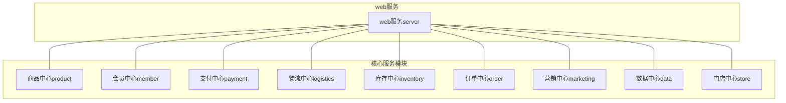

# shop-server

## introduction
模块聚合，提供web服务，与中间件交互

```mermaid
graph TD
    %% ========== 核心服务模块 ==========
    subgraph 核心服务模块
        GC[商品中心product]
        
        MC[会员中心member]
        
        PC[支付中心payment]
        
        LC[物流中心logistics]
        
        IC[库存中心inventory]
        
        OC[订单中心order]
        
        MP[营销中心marketing]
        
        DC[数据中心data]
        
        SC[门店中心store]

    end

    subgraph web服务
        SS[web服务server]
        SS --- GC
        SS --- MC
        SS --- PC
        SS --- LC
        SS --- IC
        SS --- OC
        SS --- MP
        SS --- DC
        SS --- SC
    end

```